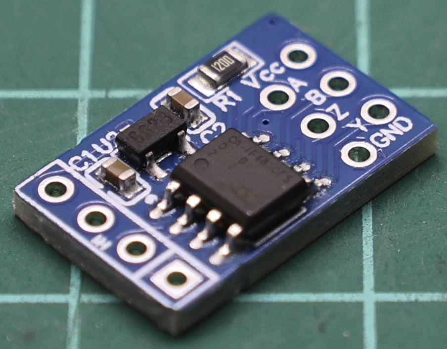
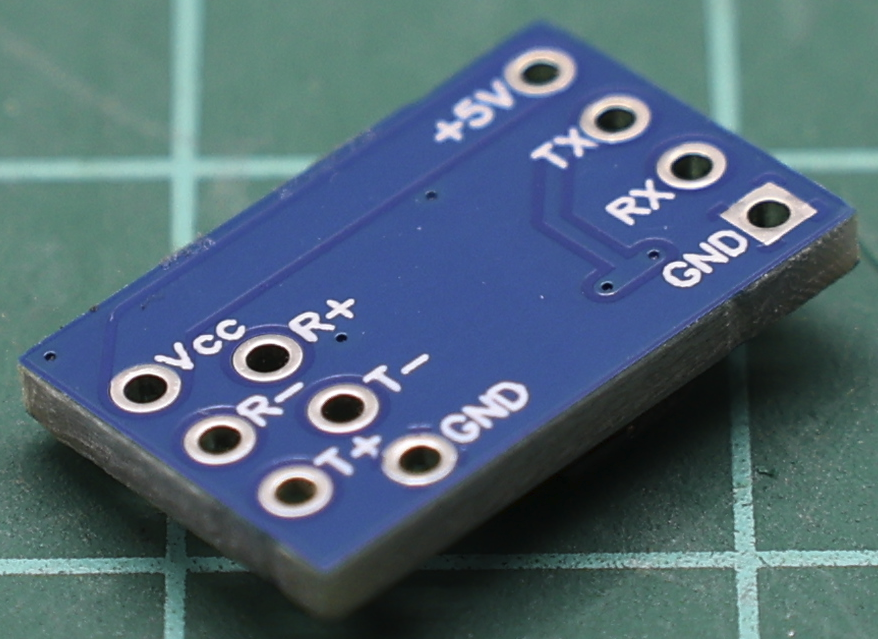
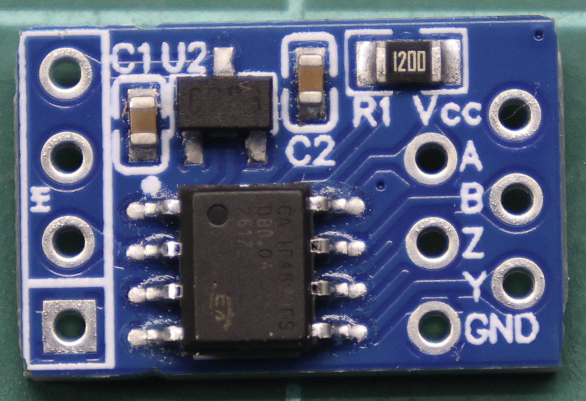
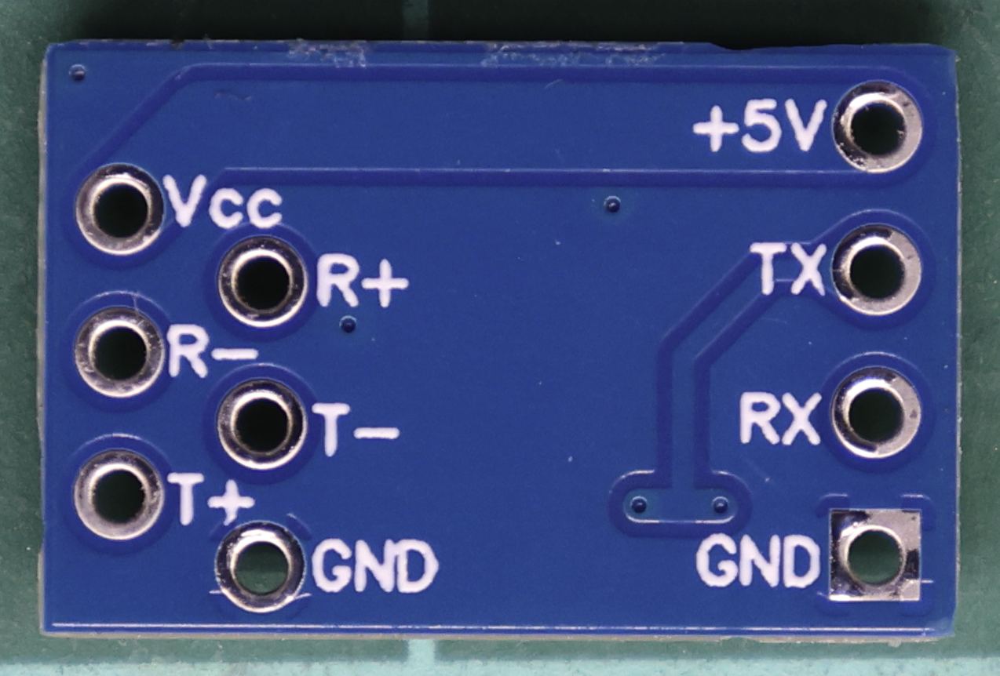
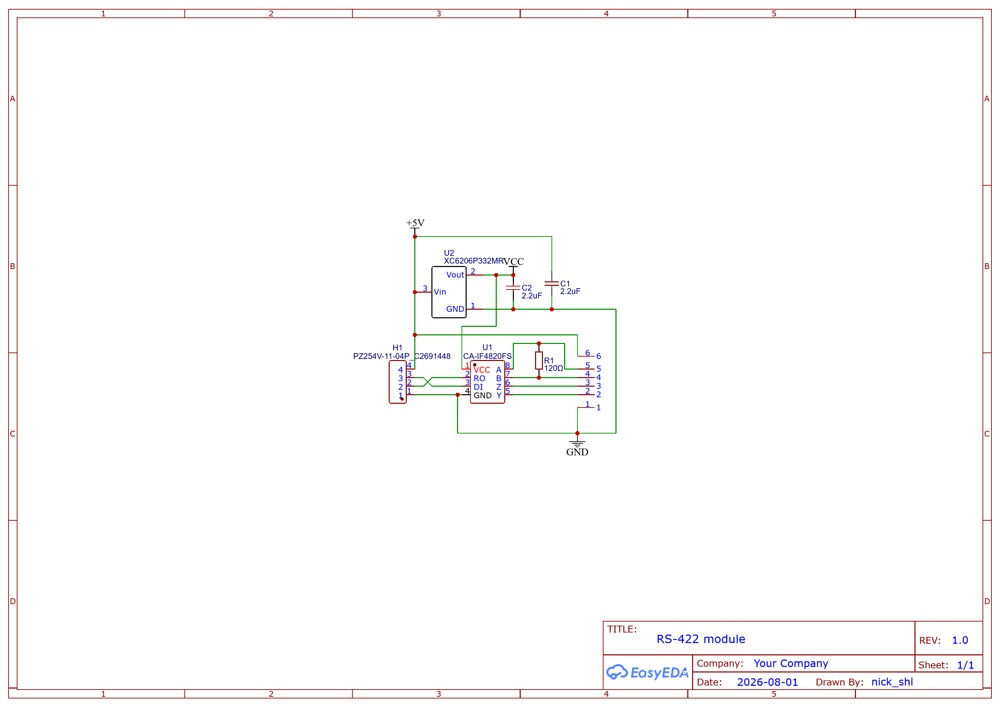

# Devtronic RS-422 Module

This project is a tiny minimalistic module to implement RS-422 differential signaling interface for UART

**Store:** https://devtronic.square.site/

# PCB files

Files for PCB can be found in PCB folder which contains Gerber, BOM and Pick and Place files, as well as EasyEDA schematic and PCB json files.

## Dimensions

**16.4** mm x **10.6** mm
Approx. 0.646" x 0.417"

## Schematic

Schematic:

# Videos

English:

Russian:

# Support

If you really like what I do and want to support my effort, you can do it by using:
https://github.com/sponsors/nickshl
https://paypal.me/nickshl
